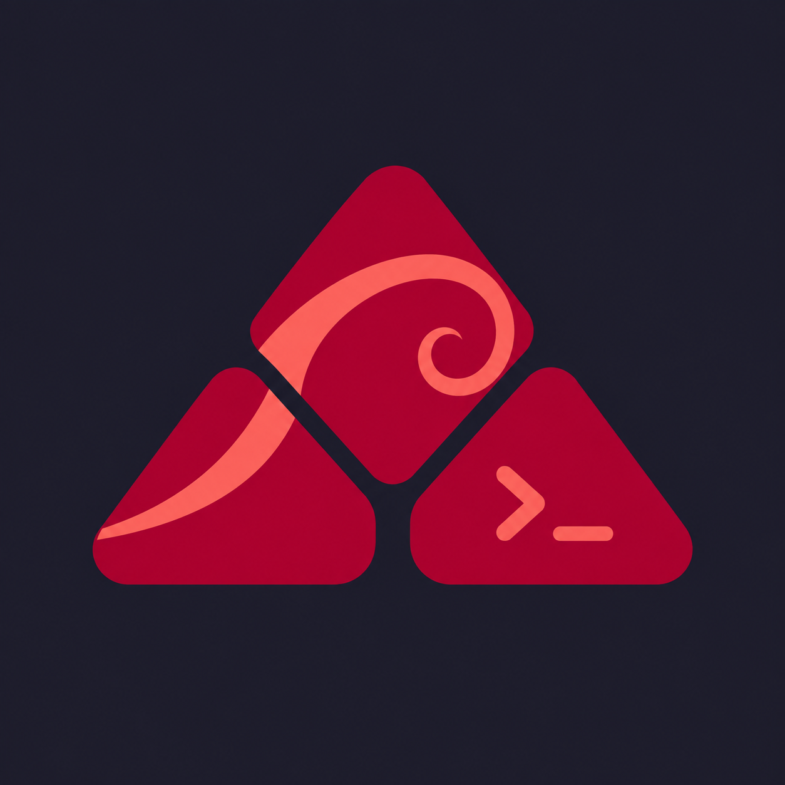

<p align="center">
  
</p>

<h1 align="center">Debian Linux Config</h1>

<p align="center">An interactive installer for a Catppuccin-inspired i3 desktop on Debian and Ubuntu.</p>

<p align="center">
  <a href="LICENSE"></a>
  
  
  
  
</p>

This is the Debian-family sibling of [arch-desktop-setup](https://github.com/AhmedAnbar/arch-linux-config):
the same desktop, the same keys, installed with apt instead of pacman.

Verified on **Debian 13 (trixie)** and **Ubuntu 26.04.1 LTS**. Other apt-based
distributions are accepted when their `ID_LIKE` names one of those families, but
are untested.

## Get started

```sh
git clone https://github.com/AhmedAnbar/debian-linux-config.git ~/debian-desktop-setup
cd ~/debian-desktop-setup
bash install.sh --dry-run   # preview every command first
bash install.sh
```

Nothing is installed or replaced without a prompt, and every file it replaces is
backed up under `~/.local/state/debian-desktop-setup/`.

## Package catalogue

Every package the installer can offer, generated from `packages/apt-map.tsv`. `Releases` says where the package exists: `both`, `debian`, `ubuntu`, or `none` when apt has no such package.

| Package | Arch counterpart | Releases | Notes |
| --- | --- | --- | --- |
| `i3-wm` | `i3-wm` | both |  |
| `i3status` | `i3status` | both |  |
| `i3lock` | `i3lock` | both |  |
| `xserver-xorg` | `xorg-server` | both | Debian splits the X server metapackage under a different name |
| `xinit` | `xorg-xinit` | both | startx and xinitrc handling |
| `xinput` | `xorg-xinput` | both | Debian drops the xorg- prefix from the X utility packages |
| `x11-xkb-utils` | `xorg-setxkbmap` | both | setxkbmap ships inside x11-xkb-utils |
| `x11-xserver-utils` | `xorg-xrandr` | both | xrandr ships inside x11-xserver-utils |
| `xserver-xorg-input-libinput` | `xf86-input-libinput` | both | Debian names the X input drivers xserver-xorg-input-* |
| `kitty` | `kitty` | both |  |
| `rofi` | `rofi` | both | Debian 13 has 1.7.5 and Ubuntu 26.04 has 2.0.0; both read the bundled themes |
| `picom` | `picom` | both |  |
| `flameshot` | `flameshot` | both |  |
| `fonts-noto` | `noto-fonts` | both | Debian font packages are prefixed fonts- |
| `dex` | `dex` | both |  |
| `xss-lock` | `xss-lock` | both |  |
| `network-manager` | `networkmanager` | both | Debian spells the NetworkManager package with a hyphen |
| `network-manager-gnome` | `network-manager-applet` | both | nm-applet ships in network-manager-gnome |
| `bluez` | `bluez` | both |  |
| `bluez` | `bluez-utils` | both | bluetoothctl ships in bluez itself; Debian has no separate utils package |
| `blueman` | `blueman` | both |  |
| `libpulse0` | `libpulse` | both | Debian suffixes the library package with its soname |
| `psmisc` | `psmisc` | both |  |
| `gsettings-desktop-schemas` | `gsettings-desktop-schemas` | both |  |
| `pipewire` | `pipewire` | both |  |
| `pipewire-alsa` | `pipewire-alsa` | both |  |
| `pipewire-jack` | `pipewire-jack` | both |  |
| `pipewire-pulse` | `pipewire-pulse` | both |  |
| `wireplumber` | `wireplumber` | both |  |
| `alsa-utils` | `alsa-utils` | both |  |
| `brightnessctl` | `brightnessctl` | both |  |
| `rofi-emoji` (not packaged) | `rofi-emoji` | none | Not packaged in Debian 13 or Ubuntu 26.04; config/i3/emoji.sh reports it is unavailable and phase 2 decides on an upstream build |
| `fonts-noto-color-emoji` | `noto-fonts-emoji` | both | Debian names the colour emoji font separately |
| `xclip` | `xclip` | both |  |
| `firefox-esr` | `firefox` | debian | Debian ships the ESR package; Ubuntu's apt firefox is only a snap transitional package, so phase 3 adds the Mozilla apt repository instead |
| `thunar` | `thunar` | both |  |
| `thunar-archive-plugin` | `thunar-archive-plugin` | both |  |
| `file-roller` | `file-roller` | both |  |
| `gvfs` | `gvfs` | both |  |
| `gpicview` | `gpicview` | both |  |
| `xdg-user-dirs` | `xdg-user-dirs` | both |  |
| `xdg-utils` | `xdg-utils` | both |  |
| `retext` | `retext` | both |  |
| `build-essential` | `base-devel` | both | build-essential is the Debian equivalent metapackage |
| `git` | `git` | both |  |
| `gh` | `github-cli` | both | Debian and Ubuntu both package the GitHub CLI as gh |
| `vim` | `vim` | both |  |
| `neovim` | `neovim` | both | Debian 13 has 0.10.4 and Ubuntu 26.04 has 0.11.6; setup-nvim.sh installs the upstream tarball when apt is older than 0.11 |
| `dialog` | `dialog` | both |  |
| `php-cli` | `php` | both | The Debian php metapackage pulls Apache; php-cli is the command-line interpreter |
| `composer` | `composer` | both |  |
| `curl` | `curl` | both |  |
| `openssh-client` | `openssh` | both | A desktop needs the client; the server is not installed by default |
| `mkcert` | `mkcert` | both |  |
| `libnss3-tools` | `nss` | both | certutil, which mkcert needs, lives in libnss3-tools |
| `iputils-ping` | `inetutils` | both | Debian splits the inetutils tools; ping is the one this desktop uses |
| `uv` (not packaged) | `uv` | none | Astral publishes no apt package; the official installer script is used in a later phase |
| `zsh` | `zsh` | both |  |
| `zsh-autosuggestions` | `zsh-autosuggestions` | both |  |
| `zsh-syntax-highlighting` | `zsh-syntax-highlighting` | both |  |
| `nodejs` | `nodejs` | both | Mason language servers need Node |
| `npm` | `npm` | both |  |
| `golang` | `go` | both | Debian names the Go toolchain golang |
| `ripgrep` | `ripgrep` | both |  |
| `fd-find` | `fd` | both | Debian installs the binary as fdfind; the Neovim configuration falls back to ripgrep |
| `unzip` | `unzip` | both |  |
| `lazygit` | `lazygit` | both |  |
| `fonts-jetbrains-mono` | `ttf-jetbrains-mono-nerd` | both | Debian packages the plain family; the Nerd Font patch is not packaged and is installed by hand if wanted |

## Keyboard

| Keys | Action |
| --- | --- |
| Alt+Enter | Kitty terminal |
| Alt+D | Rofi launcher with the selected theme |
| Alt+Shift+Q | Close the focused window |
| Shift+Caps Lock | Toggle English (US) / Arabic |
| Alt+Shift+S | Select a region and save a screenshot |
| Super+period | Emoji picker (needs a self-built `rofi-emoji`; see the catalogue) |
| Alt+Shift+C or Alt+Shift+R | Reload the i3 configuration |
| Alt+Shift+E | Log out |

## Services

The installer offers to enable `NetworkManager.service`, `bluetooth.service` and
`fstrim.timer`, plus the user PipeWire sockets and WirePlumber. Nothing is
enabled without a prompt.

No login manager is part of this phase: keep the one your installation already
has, or start the session with `startx` using the bundled `xinit`.

## Backups and undo

Every replaced file is copied to `~/.local/state/debian-desktop-setup/<timestamp>-<pid>/`
with its path preserved, so restoring one is a `cp` back.

## What comes later

Phase 1 covers the i3 desktop, the shell and the editor. Still to come, each
with its own design document under `docs/superpowers/specs/`:

1. The Sway/Wayland session, including the Waybar version guard Debian needs.
2. Third-party applications: Chrome, DBeaver, Teams, Dropbox, OnlyOffice,
   Postman, and Tor Browser fetched through a VPS.
3. System extras: Docker, SSH hardening, conky, zram and snapshots.
